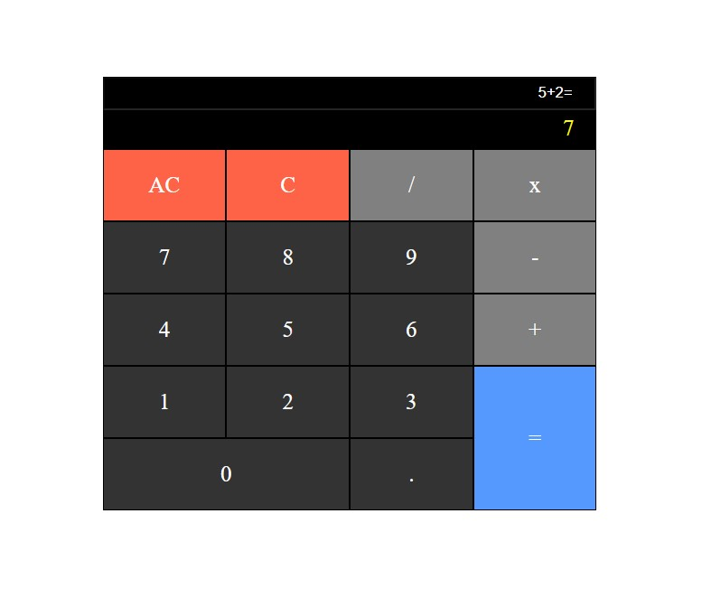

# Calculator App
This is a simple calculator application built using React. It allows users to perform basic arithmetic calculations.

## Preview

## Features
- Addition, subtraction, multiplication, and division operations
- Clearing the input
- Evaluating the expression and displaying the result

## Technologies Used
- React
- JSX
- JavaScript
- HTML5
- CSS3

## Getting Started
To get a local copy of the calculator app up and running, follow these steps:

1. Clone the repository:
   ```bash
   git clone https://github.com/your-username/calculator-app.git
2. Change your directory to the cloned repository:
   ```bash
   cd calculator-app
   ```
3. Install the dependencies:
   ```bash
   npm install
   ```
4. Start the development server:
   ```bash
   npm start
   Open your web browser and visit http://localhost:3000 to see the calculator app in action.
   ```
# Usage
The Calculator App allows users to perform basic arithmetic calculations. Follow the steps below to use the app effectively:
1. Enter Numbers: Click on the calculator buttons to enter numbers. The input field will display the expression as you enter the numbers.

2. Perform Calculations: Use the available operations to perform calculations. The supported operations are addition (+), subtraction (-), multiplication (\*), and division (/). Click on the respective buttons to apply the operation to the expression.

3. Clear Input: To clear the entire expression and reset the result, click on the "AC" (All Clear) button.

4. Remove Last Character: If you make a mistake or want to delete the last character from the expression, click on the "C" (Clear) button.

5. Evaluate the Expression: When you're ready to get the result, click on the "=" (Equals) button. The calculator will evaluate the expression and display the result in the result section.

6. Review the Result: The result of the calculation will be displayed in the result section below the input field.

7. Repeat the Process: You can continue entering new expressions and performing calculations by following the above steps.

Remember to follow the basic rules of arithmetic operations. The calculator app follows the order of operations (PEMDAS/BODMAS), where parentheses, exponents, multiplication and division, and addition and subtraction are evaluated in a specific order.

Enjoy using the Calculator App for your everyday arithmetic calculations!

## Contributing
Contributions to the drum machine application are welcome! If you find any issues or have suggestions for improvements, please open an issue or submit a pull request.

## Credits
This JavaScript Calculator project is part of the [FreeCodeCamp Frontend Certification](https://www.freecodecamp.org/learn/front-end-libraries/) course. It was completed as one of the required projects in the curriculum.

FreeCodeCamp (FCC) is a nonprofit organization that offers a comprehensive web development curriculum and certifications. The Frontend Certification focuses on frontend libraries and frameworks like React, and it covers various topics including HTML, CSS, JavaScript, and more.

Learn more about FreeCodeCamp and their educational programs on their official website: [https://www.freecodecamp.org/](https://www.freecodecamp.org/)
